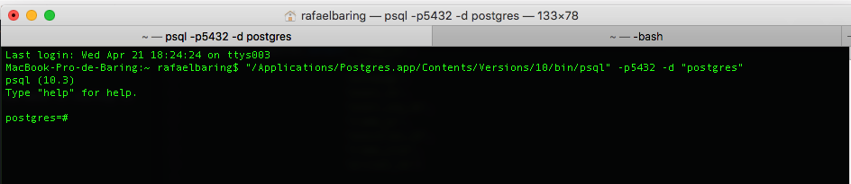

# Guided Capstone Project:
## Equity Market Data Analysis

The idea behind this project is to develop a data pipeline implementing all steps from raw data to storing in a database

### Data workflow diagram


### Project TechStack:
* Code is written in python
* Postgres running as a database
* Amazon S3 used as cloud storage
* Amazon Elastic MapReduce (EMR) to run the spark jobs in the cloud

### How to run the project:
* **Database**
Make sure you have Postgres running and PgAdmin as client to run the sql queries.



* **Config file**
You will probably need to create a config file with Postgres and AWS credentials
Create a config.py, store it at the root of the project and follow this pattern:
```
HOSTNAME = your_database_hostname
USERNAME = your_database_username
PASSWORD = your_database_password
DATABASE = your_database_database

AWS_ACCESS_KEY_ID = your_aws_key
AWS_SECRET_ACCESS_KEY = your_aws_secret_key

local_path_to_csv = local path to load csv raw data
local_path_to_json  = local path to load json raw data
s3_path_to_csv = S3 path to load csv raw data
s3_path_to_json = S3 path to load json raw data

local_log_path = directory to store logs
```

* **load_data.py:**
Script responsible for ingesting the raw data and direct it to the appropriate SQL table
When running this script, you will notice that it's set to run with the local path.
Feel free to uncomment the cloud storage path and gather the raw data from S3
Here is a snippet of how the raw events table look like


* **EOD_job.py:**
Performs the transformations requested in the guide and direct it to the appropriate SQL table

* **sqlManager.py:**
All supporting methods are related to the database.

* **log_manager.py:**
All supporting methods are related to the log.

### How to run the program:
You can use the command line to run the bash script:
The bash script will initiate the spark context and run all steps of the pipeline
> bash run_job.sh

### Cloud:
**Steps to deploy and run on the cloud**
* Create an S3 bucket and move all project files to the bucket. Special attention to the raw data file. It should follow the same path as in the local directory

* Initiate an EMR instance.
* SSH into the EMR machine. At this point, you should see something like this:

* Use the S3 CLI command to copy all files from the S3 bucket into the EMR directory
* Run bash run_job.sh
