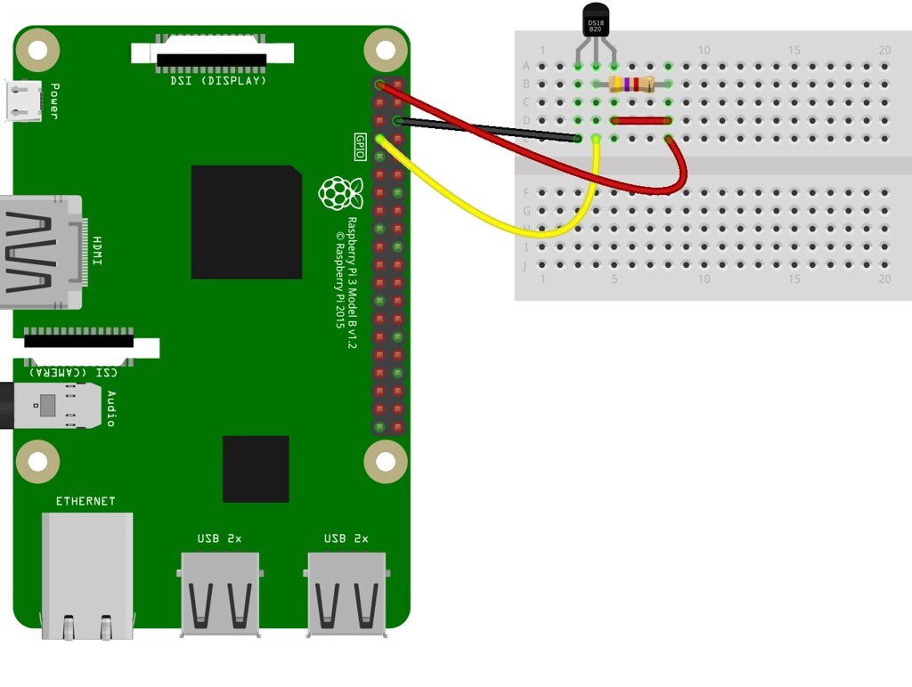

# Capstone Project:
## Using IoT and event orchestration (Kafka) to collect real-time data on my apartment

The idea behind this project is to experiment with IoT and real-time streaming data.

### Data workflow diagram


### Project TechStack:
* Project is written in Scala
* IoT sensors (more specifically temperature sensor running in a Raspberry Pi)
* Kafka as an event orchestration
* EC2 machines to run Kafka clusters
* S3 buckets to store log files
* Postgres database to monitor data entry 
* Amazon Elastic MapReduce (EMR) to run the spark jobs in the cloud

### How to run the project:
* **IoT**

For this exercise, we are utilizing a Raspberry Pi connected to a temperature sensor
Here is a description of the wiring in the circuit board


* **Database**

Make sure you have Postgres running and PgAdmin as a client to run the SQL queries.


* **Kafka Cluster**

As mentioned in the tech description, this project runs on three Kafka clusters. They are running on an EC2 machine.
In the file "KafkaConsumer.scala" please set the configurations of the Kafka cluster like so: 
```
props.put("bootstrap.servers", "XX.XXX.XXX.X:XXXX") // insert here the IP of the EC2 instance
props.put("group.id", "Y")
```
Here is a screenshot with all three clusters running


* **S3 bucket**

Make sure that you have an S3 bucket created


### Deploy script:

Please refer to the bash script "deploy.sh" to deploy your project.
Once again, important to notice that the script will successfully run if all criteria above (Postgres, Kafka, and S3 bucket) are meet
> bash deploy.sh


### Successfully running in the cloud:
* **Logging files in S3 bucket**
The project is designed to log data files into an S3 bucket at the end of a cycle. If successfully, this is what you should see in an S3 bucket


* **Postgres data monitoring**
The data sent by the producer will be stored in a Postgres table for monitoring purposes. After a cycle, you should be able to query the data
Here is an example of how the table should look like
